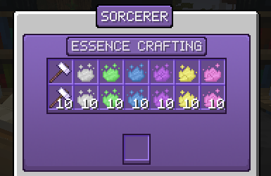

# Custom Items
All about using, crafting, upgrading, and repairing custom items.

## Crafting Custom Items

The Blacksmith can craft and upgrade materials, weapons, repair stones/artifacts, and armor. The Blacksmith is located at spawn or at `/warp crafting`.

The Sorcerer can craft potions, staffs, wands, catalysts, tomes, runes, and item essence. The Sorcerer is located next to the Blacksmith at spawn.

## Types of Custom Items

There are a variety of Custom Item types, which each corresponding to different attributes. For instance, Daggers have a fast attack speed but low attack damage, and Greatswords have a slow attack speed and are two-handed but have a high attack damage.

:::warning
Magic Items cannot be enchanted!
:::

## Attributes

All Custom Items have various attributes assigned to them. This can be seen when you hover your mouse cursor over the item.

### All Attributes for Weapons

* Attack Damage - The Melee or Ranged Damage that the weapon deals.  
* Attack Speed - The attack speed of the weapon.  
* Critical Strike Chance - The chance of dealing a critical strike.  
* Critical Strike Power - The percentage of the initial damage a critical strike deals in extra.  
* Range - The range of the weapon.  
* Arrow Velocity - The velocity of the arrow.  
* AOE Radius - The radius of the area-of-effect damage.  
* AOE Damage - The damage of the area-of-effect damage.  
* Two Handed - Specifies if the weapon is two-handed. If a weapon with this attribute is duel-wielded, the attack speed will be greatly reduced.  
* Magic Damage - Extra magic damage dealt.  
* On Hit Damage - The damage that an ability deals.  
* Physical Damage - Extra physical damage dealt.  
* Projectile Damage - Damage dealt with arrows, staff projectiles, and extra projectile damage.  

### All Attributes for Armor and Defense Items

* Block Power - The percentage of incoming damage that this item can block.   
* Block Chance - The chance that an incoming damage will be partially blocked.   
* Dodge Chance - The chance that an incoming damage will be fully dodged.   
* Parry Chance - The chance of dodging an incoming damage, knocking enemies back.  
* Health - The amount of extra health given.  
* Movement Speed - The amount of extra movement speed given.  
* Defense - The amount of defense points the item grants.  
 
* Max Mana - The amount of extra mana the item can grant to your total mana.  
* Mana Regeneration - The speed of the mana regeneration.  
* Skill Cooldown Reduction - The percentage of the cooldown timer for item skills.  
* Elemental Damage - See below.  

## Elemental Damage

Custom Items can have an Elemental Damage attribute. Elemental Damage (%) represents the chance for an item to perform an Elemental Critical Attack. Elemental Critical Attacks both increase weapon damage and applies unique attack effects.

**Fire** - Doubles fire damage and ignites your target.  
**Ice** - Doubles ice damage and roots the target for a short duration.  
**Wind** - Doubles wind damage and applies a powerful AoE knockback.  
**Earth** - Doubles earth damage and applies a powerful AoE knockup.  
**Thunder** - Doubles the thunder damage and damages nearby enemies.  
**Water** - Weakens the target increasing their damage taken by 30% for 5 seconds.  

## Skills

All Custom Items have their own **special skills**. This can be seen when you hover your mouse cursor over the item. Depending on the weapon, the skill may use mana or have a cooldown. Every skill is unique, so try it out for yourself!

## Upgrading Items

Upgrading an item from the Blacksmith will increase stats on a Custom Item. Items can be upgraded up to 5 times (stars) at the Blacksmith, using item essence and a portion of the item's crafting materials.

## Upgrade Scalings

Depending on the type and rarity of the item you are trying to upgrade, the results may be different. For instance, daggers get a 4% attack damage and 2.5% attack speed increase per level, while swords get a 6% attack damage and no attack speed increase per level. All scalings of upgrades can be read over at the [Upgrade Scalings](upgrade-scalings.md) page.

## Item Essence

Item essence is used for upgrading items or repairing items. They can be crafted at the Sorcerer using Essence Powder, which is obtained by killing any normal or custom mobs.

## Repairing Custom Items

Items are repaired using Repair Stones and Artifacts based on their rarity. Repair Stones only repair a certain amount of durability, while Repair Artifacts fully repair an item. Repair items can be crafted in the Blacksmith.

## Runes

Runes are used to upgrade stats to Custom Items. Depending on the type of the Rune, it may increase the amount of damage, critical strike chances, and more. Runes are crafted in the Sorcerer.

## Armor Tiers
Here are all the full armor sets ordered by the amount of defense from least to greatest.  

Vanilla Iron Armor -> Orc Set -> Vanilla Netherite Armor -> Evergreen Set -> Geo Set -> Scorched Set -> Glacial Set -> Warden Set -> Infernal Set -> Slate Set -> Desert Assassin Set -> Void Warrior's Set -> Cryohex Set -> Volcanic Set -> Blizzard Set -> Titanic Set  

**Note that this order does NOT take full set bonuses, skills, items, or enchantments which can all affect total defense greatly.**

## Slate Armor Set
Skipping from an Overworld armor set to the Slate armor set is **STRONGLY DISCOURAGED** due to the difficulty of the Basalt Deltas. You **WILL** suffer. **You have been warned!**